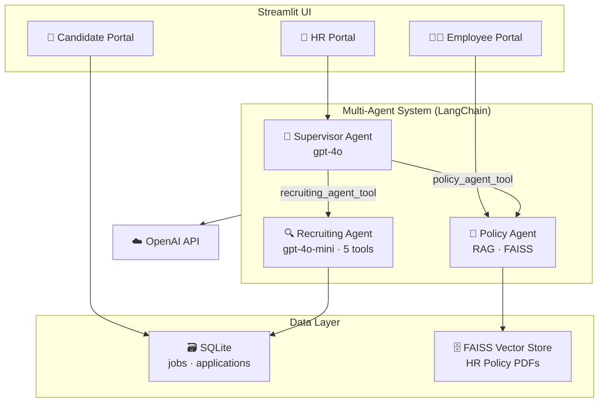

# Agentic HR Assistant — Architecture

```mermaid
flowchart TD
    subgraph UI["Streamlit UI"]
        HR["🏢 HR Portal"]
        Candidate["👤 Candidate Portal"]
        Employee["👩‍💼 Employee Portal"]
    end

    subgraph Agents["Multi-Agent System (LangChain)"]
        SUP["🧠 Supervisor Agent\ngpt-4o"]
        REC["🔍 Recruiting Agent\ngpt-4o-mini · 5 tools"]
        POL["📖 Policy Agent\nRAG · FAISS"]
    end

    subgraph Storage["Data Layer"]
        DB["🗃️ SQLite\njobs · applications"]
        FAISS["🗄️ FAISS Vector Store\nHR Policy PDFs"]
    end

    OAI["☁️ OpenAI API"]

    HR --> SUP
    Employee --> POL
    Candidate --> DB

    SUP -->|recruiting_agent_tool| REC
    SUP -->|policy_agent_tool| POL

    REC --> DB
    POL --> FAISS

    Agents --> OAI
```
